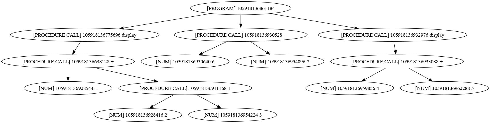

## About
The compiler compiles R5RS Scheme (see [r5rs.pdf](docs/r5rs.pdf) for details) into X64 NASM code which is intented to run on Linux.
### Details
The compiler uses a lexical analyzer built using Thompson constrution (implementing Gluskhov's construction is in the plans), and a syntax analyzer built using LR(1) parsing. The syntax tree produced by the syntax analyzer is converted to AST (Abstract Syntax Tree) and then intermediate code is generated, the IR layout is inspired by [LLVM](https://github.com/llvm/llvm-project) IR. IR code is translated to X64 NASM. The standard library is partly implemented and can be seen in [src/std](src/std) folder.
### How to use
After building the projects there is an executable file called `compiler_output` in the build directory. The executable expects 2 arguments passed: the input file path and the output folder path (the folder should be as it is created by the compiler). 
There are some example files in `examples` folder you can use. For example:
```shell
rm output -r ; ./build/compiler_output ./examples/display.scheme ./output
```
Then `output.nasm` file is created, which can be compiled firstly into object file:
```shell
nasm -f elf64 ./output/output.nasm -o ./output/output.o
```
Then you need to link the standard library which is built along with the compiler:
```shell
ld ./output/output.o ./build/src/std/CMakeFiles/std.dir/std.asm.o -o ./output/output
```
Then you can run `./output/output`.

#### Additional files
There are some additional files in the output folder, namely: `ast.txt` and `st.txt` which can be vizualized using `dot` from `graphviz`. Visualized `ast.txt` looks like this:

You can also check how IR code looks by checking `ssa.txt`.
## Build
To build the compiler into **build** folder:
```shell
cmake -S . -B ./build && cmake --build build/
```
### Test
The project has tests for the lexical and syntax analyzers, to run the tests:
```shell
ctest --test-dir ./build
```
